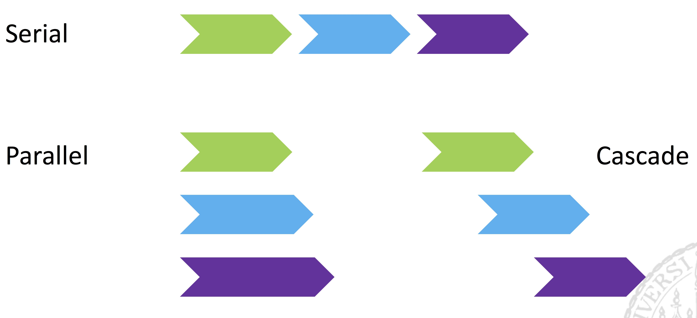
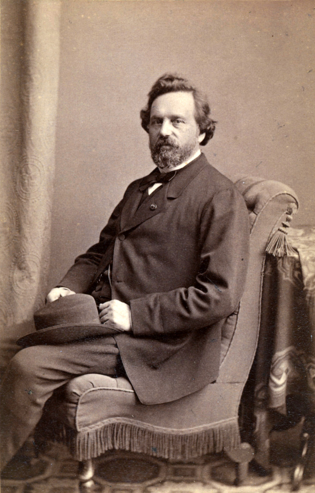
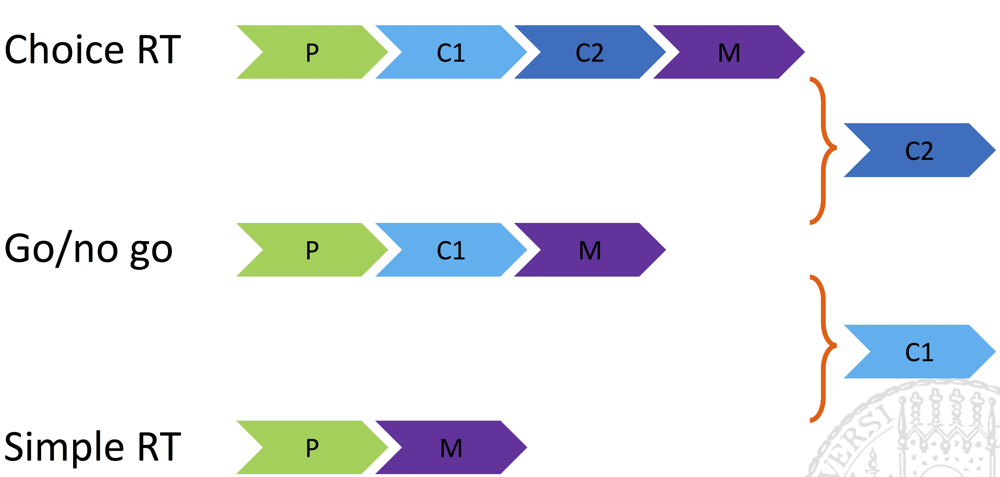
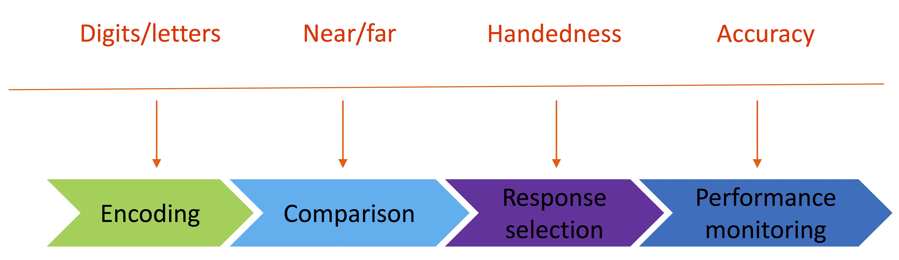
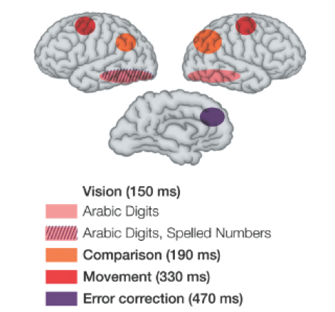

```{r setup, include=FALSE}
library(knitr)
library(pander)
library(dplyr)
library(ggplot2)
library(xtable)
options(xtable.comment=FALSE, digits = 2)
knitr::opts_chunk$set(echo = FALSE,fig.align='center')
```

# Football goal keeper

```{r, out.width='85%'}
knitr::include_graphics('figs/football.jpg')
```

# Airport Security check

```{r, out.width='85%'}
knitr::include_graphics('figs/airport.jpg')
```

# Stroop paradigm


* Task: name the color of the word, while ignore the word itself.
    * \textcolor{red}{Book}
    * \textcolor{red}{Green}
    * \textcolor{red}{Red}

```{r, out.width='100%'}
knitr::include_graphics('figs/stroop_rt.jpg')
```

# Mental Chronometry

__Mental chronometry__ is the use of response time to infer mental processes. The way for this is the manipulation of the tasks and/or of variables determining the behavior of participants in the tasks. 

Mental chronometry is one of the core paradigms of experimental and cognitive psychology. 


# Cognitive processes and processing time

* __Reaction time (RT)__, measured the elasped time between the presentation of a sensory stimulus and the subsequent behavioral response, is an index of processing speed. 
    * Duration of sequential processes between stimulus onset and response production

* What cognitive processes do reaction time and error data represent?

```{r, fig.align='center', out.width='100%'}

```

# Behavioral measures

\begincols {0.6\textwidth}

* Reaction times (RTs)
* Error rates
* Speed-accuracy trade-offs (SAT)
    * Relation between RTs and errors
* For various effectors
    * Hands, eyes, legs

\colsep {0.4\textwidth}

```{r, fig.align='center', out.width='100%'}

```
\endcols

# Main questions

* How many components (modules)?
* What components (modules) exactly?

```{r, out.width='100%'}
knitr::include_graphics('figs/process_components.jpg')
```

# Underlying cognitive structures

\begincols {0.6\textwidth}

* How the processing components interact with each other?
* The information transmission between and within the processing components?
* Continuous versus discrete processing?
* Serial, parallel or partially parallel (cascade) processing?

\colsep {0.4\textwidth}

```{r, fig.align='center', out.width='100%'}
knitr::include_graphics('figs/brains.jpg')
```
> <sub>http://thomascotterill.wordpress.com</sub>

\endcols

# Different architectures

```{r, out.width='100%'}

```

# Donders' subtraction idea

\begincols {0.6\textwidth}

> The idea occurred to me to _interpose into the process of the physiological time some new components of mental action_. If I investigated how much this would lengthen the physiological time, this would, I judged, reveal the time required for the interposed term.

\colsep {0.4\textwidth}
```{r, fig.align='center', out.width='85%'}

```
> <sub>Franciscus C. Donders</sub>

\endcols

# Pure insertion assumption

* Condition A has all the stages of condition B
* Condition B has __one less__ stage
* Duration of the extra process can be identified:

$$ RT_A - RT_B $$

# How do we 'interpose' processes?

* Use different tasks, keeping the same stimuli

```{r, out.width='100%'}
knitr::include_graphics('figs/tasks.jpg')
```

# What do RTs reflect

```{r, out.width='100%'}

```

# What if we do not observe a difference?
\begincols {0.6\textwidth}

* Then we have a puzzle to solve
    1. C1 does not take place at all
    2. C1 takes place in both cases
    3. Our test did not have enough power

\colsep {0.4\textwidth}
```{r, fig.align='center', out.width='85%'}

```
\endcols

# Example: Posner & Mitchell (1967)

\begincols {0.6\textwidth}

* Using different stimuli, keeping the same task
    * Task: Are two letters both consonants or both vowels?

* For examples:
    * AA, BB - same shape
    * Aa, Bb - same name
    * AE, BC - same category

\colsep {0.4\textwidth}
```{r, fig.align='center', out.width='85%'}

```
> Michael Posner won National Medal of Science (2008)

\endcols

# Example: Posner & Mitchell (1967)

```{r, out.width='100%'}
knitr::include_graphics('figs/posner.jpg')
```

* Name comparison: 74 ms (623 - 549)
* Category comparison: 178 ms (801 - 623)

# Application in neurosciences
\begincols {0.6\textwidth}

* Prevailing method in fMRI (PET)
    * Cognitive subtraction to find regions associated with certain cognitive functions
* Typical design, blocks of trials with
    * Resting/baseline
    * A simple condition
    * A more complex condition

\colsep {0.4\textwidth}
```{r, fig.align='center', out.width='85%'}
knitr::include_graphics('figs/fmri.jpg')
```
\endcols

# Subtraction method in neurosciences
```{r, out.width='100%'}
knitr::include_graphics('figs/torsten.jpg')
```

# Does this really make sense?

\pause

* Transitivity problem
    * Do individually isolated durations sum up to the duration of the conditions in which they all take place?

```{r, out.width='100%'}
knitr::include_graphics('figs/transitivity.jpg')
```

# Why subtraction method fails?

\begincols {0.5\textwidth}

__Assumption__

* Pure insertion
    * insertion/removal of processing stages does not influence other processing stages
* Successive processing
    * subcomponents do not overlap and add independently to the overall RT

\colsep {0.5\textwidth}

__Criticsm__

* Külpe (1893): insertion of a new process changes of the whole task
* Cascades/overlapping processing is much more plausible processing architecture

\endcols

# Summary - subtraction method
* Subtraction method is very useful, especially for fMRI
    * fMRI subtracts __space__
    * RT subtracts __time__
    * subtraction method in fMRI does not tell much about _connectivity patterns_.
* Not a very plausible model for complexity cognitive system
    * e.g., massively parallel system

# Additive factor method (AFM)

* No pure insertion assumption
* Change in paradigm (compared to pure insertion)
    * keeping the task __same__
    * Varying task properties
* Change in questions
    * What __independent__ cognitive processes determine task performance?
* Developed by Sternberg (1969)

# Additive factor method (AFM)
* Change in paradigm

```{r, out.width='100%'}
knitr::include_graphics('figs/afm.jpg')
```

* if __two__ experimental manipulations influence __different stages__, they should produce __additive RT effects__
* if there are additive effects, there are different processing stages

# Sternberg task

* Task
    * Memory list followed by a test stimulus
    * Was the test in the memory list?

> L B R F --> B ?

* Manipulated factors:
    * Test quality (degraded vs. intact)
    * Memory load (1, 2, or 4 items)

# Sternberg task

\begincols {0.5\textwidth}

* Main effect of _stimulus quality_
* Main effect of _load_
* No interaction!
* These two properties influence independent processes

\colsep {0.5\textwidth}

```{r, fig.align='middle', out.width='85%', fig.width=4, fig.height=3}
dat = data.frame(rt = c(377,400, 440, 412, 440, 480),
                 quality = c(rep('Intact',3), rep('Degraded',3)),
                 load = rep(c('1 Item','2 Items','4 Items'),2))
ggplot(dat, aes(quality, rt, color = load, group = load, shape = load)) + geom_line() + geom_point(size = 3) +  ylab('RT (ms)') +
  theme_classic() 
```
\endcols


# What if we have no interactions?
\pause

\begincols {0.6\textwidth}

* Manipulations affect independent processes
* Or, the test was not powerful enough

\colsep {0.4\textwidth}
```{r, out.width='90%'}
knitr::include_graphics('figs/whatif.png')
```
\endcols

# Example: AFM in cognitive neuroscience

* Cognitive and neural mechanisms of number comparison (Dehaene, 1996)
    * A number is presented on the display and subjects decide whether the number is __greater__ or __less__ than 5.

* Manipulations:
    * Input: Arabic digits / spelled numbers (4 / four)
    * Comparison: Near 5 / far from 5
    * Response: dominant / non-dominant hand

# Cognitive model

```{r, out.width='100%'}

```

# AFM in RTs

\begincols {0.5\textwidth}

* Each manipulation produced a significant main effect
* But no interactions!

\colsep {0.5\textwidth}

```{r, fig.align='middle', out.width='100%', fig.width=4, fig.height=3}
dat = data.frame(rt = c(383,395, 420, 435, 363, 375, 407, 417),
                 Comparison = c(rep('Close',4), rep('Far',4)),
                 Input = rep(c('Arabic','Arabic','Spelled','Spelled'),2),
                 Response = rep(c('Right','Left'),4))
ggplot(dat, aes(Comparison, rt, color = Response, group = interaction(Response,Input), shape = Input)) + geom_line() + geom_point(size = 3) +  ylab('RT (ms)') +
  theme_classic()
```
\endcols

# Brain regions involved in the task

\begincols {0.5\textwidth}

* Distinct brain regions were modulated by different manipulations

\colsep {0.5\textwidth}

```{r, out.width='100%'}

```

\endcols

# Does AFM make sense?

\pause

* __Partially__

* No problem with 'pure insertion'
    * Manipulation of the duration of a processing stages
* Criticism of Külpe does not hold
    * Comparison between one and the same type of tasks


# Does AFM make sense?

* __Not completely__

* Still assumption of serial processing stages
* Reversed inference fallacy
    * __If p then q__: Manipulation of independent stages will produce additive results
    * But, this does not imply __if q then p__: Failing to observe significant interactions does not imply independence of stages

# Summary of AFM
* Same task, but different manipulations
* each manipulation affect processes independently
* No problem of 'pure insertion'
* Be aware of the reversed inference fallacy

# discrete sequential stages vs. Cascaded/Parallel processes

* Both Subtraction method and AFM require _Sequential processing_

```{r, out.width='60%', fig.width=6}
knitr::include_graphics('figs/mcclelland_cascade.pdf')
```

# Continuous models of information processing

\begincols {0.6\textwidth}

* Cascade model of information processing
    * Each stage is continously active and feeds to the next stage. 
    * An experimental manipulation may affect a stage by altering the __rate__ of activation or the __asymptotic level__ of activation. 
    * The asymptotic level is equivalent to the stage output in the discrete stage model. 

\colsep {0.4\textwidth}   
    
```{r activation_fun, echo = FALSE, out.width = '98%',fig.width= 4, fig.height=3}
ggplot(data.frame(t = c(0,2)), aes(t)) + 
    stat_function(fun = function(t) 1-exp(-t), 
                 aes(colour = 'Rate 1, Max 1')) +
    stat_function(fun = function(t) (1-exp(-2*t)), 
                 aes(colour = 'Rate 2, Max 1')) + 
    ylab('Activation') + xlab('Time (sec)') + theme_classic() +
    theme(legend.position = c(0.8,0.2), legend.title = element_blank()) 
  
```

\endcols

# Cascade model vs. AFM

* Simulations show that assumption of cascaded processes allows emergence of additive effects of manipulations of the same processing stage. 
* Additive effects may also result from two factors affecting the rates of two different processes
* Different interprepretation of interaction than AFM:
    * Interactions are possible if two manipulations affect different types of processes (e.g., A affects the rate of stage 1, and B impacts asymptotic component of stage 2).

# Example of interaction in cascade model

\begincols {0.5\textwidth}

* Meyer et al. (1975) Lexical decision task (word vs. nonword)
    * Preceded by a prime word
    * Manipulation: 
        * degradation of the prime word
        * semantial relatedness
  
\colsep {0.5\textwidth}   

```{r Meyer1975, echo = FALSE, out.width = '98%',fig.width= 4, fig.height=3 }
meyer = data.frame(RT = c(566,528,728,657), 
         Degradation = c('Intact','Intact', 'Degraded','Degraded'), 
         Semantics = c('Unassociated','Associated','Unassociated','Associated'))
ggplot(data = meyer, aes(x = Degradation, y = RT, fill = Semantics)) + 
  geom_bar(stat='identity', position = 'dodge') + coord_cartesian(ylim = c(450,800)) + theme_classic() +
    theme(legend.position = c(0.8,0.8), legend.title = element_blank()) 
  
```

\endcols

# Example of interaction in cascade model

* (A) Interaction of visual degradation and (B) semantic relatedness
* AFM interpretation:
    * A and B affect one same stage: Early encoding of visual information (Meyer et al., 1975)
* Cascade model:
    * Interaction could be related to manipulation of two processes:
        * A on rate of encoding
        * B on asymptotic maximum of semantic retrieval process
* Cascade model takes more naturalistic view on mental proceses
    * assumption of parallel processing highly plausible 
    * but no easy assessment of the duration of mental processes
 
# Continuous models of information processing

\begincols {0.5\textwidth}

* Accumulation models
    * decisions are built up with accumulation of information. 
    * e.g., stochastic diffusion model (Ratcliff, 1979)

\begin{align*}
RT &= T_{0} +  X_{decision} \\
dX(t) &= vdt + sdW(t)
\end{align*}

\colsep {0.5\textwidth}  

```{r, out.width='95%'}
include_graphics('figs/diffusion.pdf')
```

>      - Grasman et al. (2009)

\endcols

# Evidence accrual vs. discrete processes

* Classical discrete processes 
    * A chain of discrete processes
* Accrual model considers RTs as continuous durations of all previous decisions
* Two methods can be combined together to evaluate underlying processes
    * Compare diffusion parameters across tasks (subtraction method + diffusion)
    * Explicit modeling of a decision chain (AFM + diffusion)
    
# Accumulation/diffusion models

* Provide several dependent measures for which effects of experimental manipulations can be assessed
* Combine well with classical experimental methods
* Can predict both mean RTs and RT distributions, and error patterns

# RT distributions

* The whole RT distribution provide more rich information than __mean__ and __standard error__ of RTs. 

```{r rtDistr, echo = FALSE, out.width= '70%', fig.width=4, fig.height=3}
dat = read.csv('stroop.csv')
dat %>% filter(rt < 2) %>% 
  ggplot(aes(x = rt, fill = congruency)) + geom_histogram(bins = 30)
```

# Parameters of RT distributions

\begincols {0.5\textwidth}

* Three important parameters
    * First order (Mean, median, mode)
    * Variability (Variance, semi-inter-quartile range)
    * Asymmetry (skewness)

\colsep {0.5\textwidth}  

```{r rtDistr2, echo = FALSE, out.width= '95%', fig.width=3, fig.height=3}
dat %>% filter(rt < 2) %>% 
  ggplot(aes(x = rt, fill = congruency)) + geom_histogram(bins = 30)
```

\endcols

# Why RT distribution is left skewed?

\pause

* RT distribution is non-negative distribution
* biological constrains on fastest response time
* tendency of delay response
* RT distribution can be regarded as the first passage time of a diffusion process


# Drift diffusion model (DDM, Ratcliff, 1978)

\begincols {0.6\textwidth}

* Accumulations of difference between the amounts of evidence supporting the two alternative hypothese. 
    * Upper bound and lower bound (i.e., decision thresholds for 2AFC)
    * A starting point, which reflects initial evidence (prior)
    * Information accumulation drifts towards two boundries with different drift rate (v)
    * When information reach the thresholds, response is fired. 
    
\colsep {0.4\textwidth}  

```{r, out.width='95%'}
include_graphics('figs/ddf.pdf')
```
 
- Bogacz et al., 2006, Psychological review

\endcols

# Parameters in DDM

\begincols {0.5\textwidth}

Original DDM (ratcliff, 1978) has 4 parameters:

* drift rate $v$
* threshold separation ($a$)
* starting-point ($z$)
* Non-deicsion time ($t_0$)

\colsep {0.5\textwidth}  

```{r, out.width='95%'}
include_graphics('figs/diffusion.pdf')
```

>      - Grasman et al. (2009)

\endcols

# Interpretation of DDM parameters

The most important part in a diffusion model analysis is determing which psychological processes are mapped by the parameters. 

\pause

* drift rate ($v$): speed of information update
    * easy task - large drift rate; difficult task - small drift rate

\pause

* Threshold separate ($a$) 
    * Amount of information for a decision: conservative - large $a$, liberal - small $a$

\pause

* Starting point ($z$): A priori biases in the decision thresholds

\pause

* Nondecision processes ($t_0$)
    * encoding process, response excusion (e.g., aging difference).


# Speed-accuracy trade-off function

* RTs typically co-vary with error rates

```{r, out.width='75%'}
include_graphics('figs/sat.jpg')
```
> Reis et al., PNAS, 2009

# Why is this important?

\begincols {0.5\textwidth}

Effect in RTs may reflect 

* effects of your manipulations
* shifts in position on SAT function


\colsep {0.5\textwidth}  

```{r, out.width='95%', fig.width= 4, fig.height=3}

ggplot(data.frame(t = c(0.1,2)), aes(t)) + 
    stat_function(fun = function(t) 0.4*exp(-t), 
                 aes(colour = 'Difficult')) +
    stat_function(fun = function(t) 0.4*(exp(-2*t)), 
                 aes(colour = 'Easy')) + 
    ylab('Error rate') + xlab('Time (sec)') + theme_classic() +
    theme(legend.position = c(0.8,0.8), legend.title = element_blank()) 

```


\endcols

# Controlling for SAT shifts

* Maintain either exposure time or error rate constant
    * Exposure time constants - using the masking paradigm
    * error rate constant - providing feedback and reward/punishment
* If RT is your main dependent variable, you should make sure the error rates are relative equal across different experimental manipulations. 

# Experiments

* Stroop effect
    * named after John Ridley Stroop
    * 3 groups: neutral, congruent, and incongruent
    * Semantic interference and facilitation
* Simon effect
    * named after J. R. Simon
    * Tendency to react towards the source of the stimulation
    * Spatial mapping and response selection interference
* Dynamic vs. Static search
    * search efficiency, measured by search slope, for dynamic and static displays were similar (Horowitz & Wolfe, 1998)
    * Arguing memory has little role in visual search
    * But possible speed-accuracy trade-off
    
