```{r setup, include=FALSE}
library(knitr)
library(pander)
library(ggplot2)
library(xtable)
options(xtable.comment=FALSE, digits = 2)
knitr::opts_chunk$set(echo = FALSE,fig.align='center')
```


# Football goal keeper

```{r, out.width='85%'}
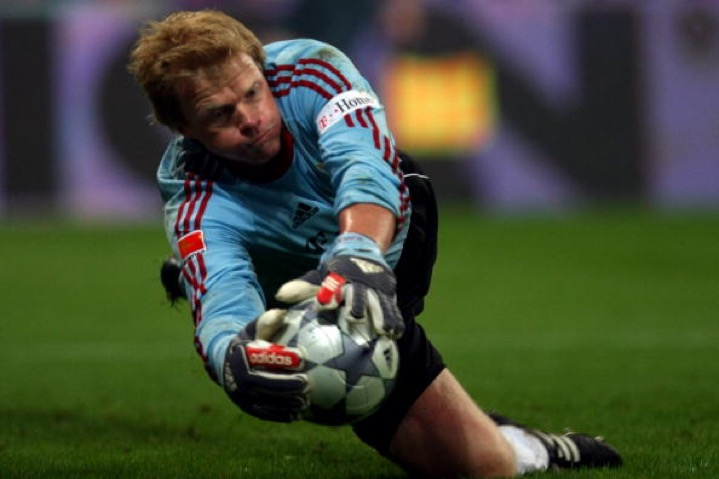
```

# Airport Security check

```{r, out.width='85%'}
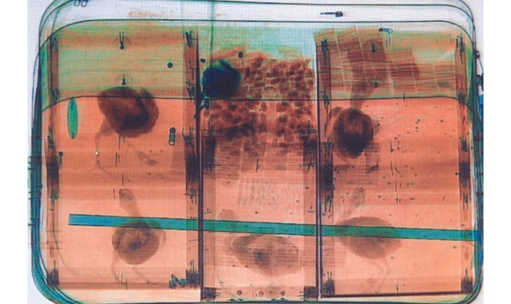
```

# Stroop paradigm


* Task: name the color of the word, while ignore the word itself.
    * \textcolor{red}{Book}
    * \textcolor{red}{Green}
    * \textcolor{red}{Red}

```{r, out.width='100%'}
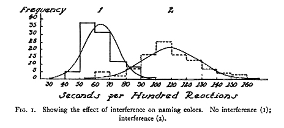
```

# Mental Chronometry

__Mental chronometry__ is the use of response time to infer mental processes. The way for this is the manipulation of the tasks and/or of variables determining the behavior of participants in the tasks. 

Mental chronometry is one of the core paradigms of experimental and cognitive psychology. 


# Cognitive processes and processing time

* __Reaction time (RT)__, measured the elasped time between the presentation of a sensory stimulus and the subsequent behavioral response, is an index of processing speed. 
    * Duration of sequential processes between stimulus onset and response production

* What cognitive processes do reaction time and error data represent?

```{r, fig.align='center', out.width='100%'}

```

# Behavioral measures

\begincols {0.6\textwidth}

* Reaction times (RTs)
* Error rates
* Speed-accuracy trade-offs (SAT)
    * Relation between RTs and errors
* For various effectors
    * Hands, eyes, legs

\colsep {0.4\textwidth}

```{r, fig.align='center', out.width='100%'}

```
\endcols

# Main questions

* How many components (modules)?
* What components (modules) exactly?

```{r, out.width='100%'}
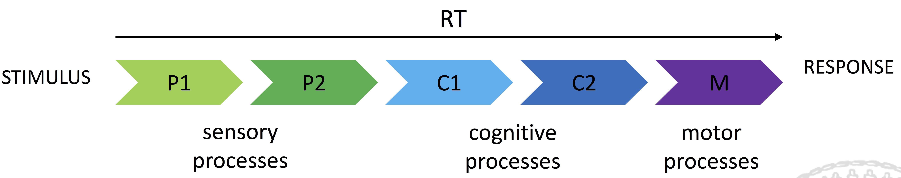
```

# Underlying cognitive structures

\begincols {0.6\textwidth}

* How the processing components interact with each other?
* The information transmission between and within the processing components?
* Continuous versus discrete processing?
* Serial, parallel or partially parallel (cascade) processing?

\colsep {0.4\textwidth}

```{r, fig.align='center', out.width='100%'}
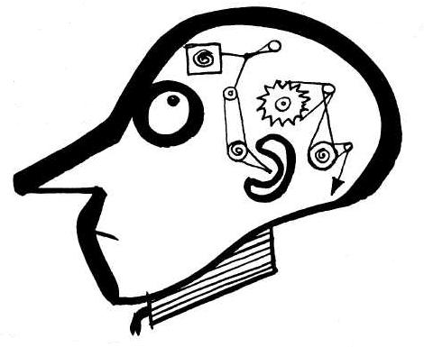
```
> <sub>http://thomascotterill.wordpress.com</sub>

\endcols

# Different architectures

```{r, out.width='100%'}
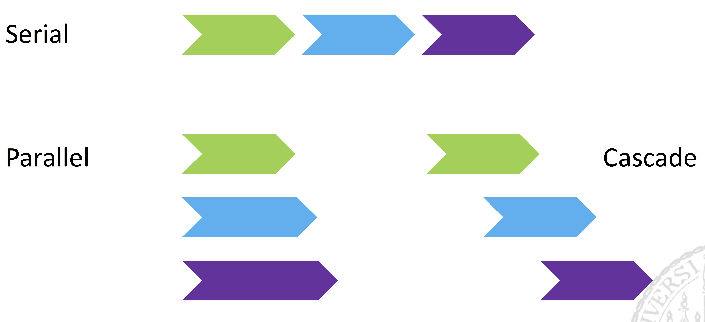
```

# Donders' subtraction idea

\begincols {0.6\textwidth}

> The idea occurred to me to _interpose into the process of the physiological time some new components of mental action_. If I investigated how much this would lengthen the physiological time, this would, I judged, reveal the time required for the interposed term.

\colsep {0.4\textwidth}
```{r, fig.align='center', out.width='85%'}
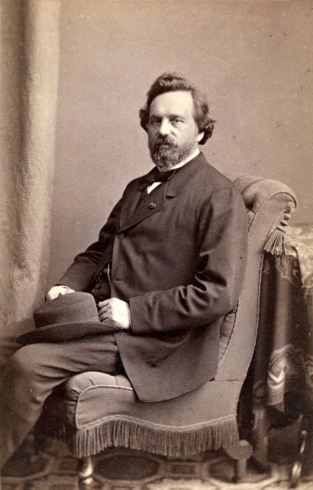
```
> <sub>Franciscus C. Donders</sub>

\endcols

# Pure insertion assumption

* Condition A has all the stages of condition B
* Condition B has __one less__ stage
* Duration of the extra process can be identified:

$$ RT_A - RT_B $$

# How do we 'interpose' processes?

* Use different tasks, keeping the same stimuli

```{r, out.width='100%'}
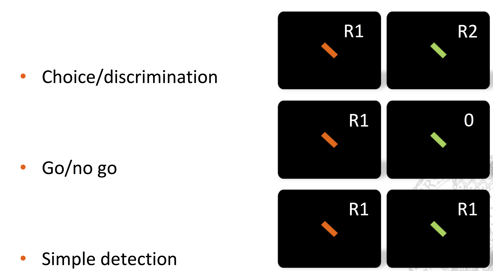
```

# What do RTs reflect

```{r, out.width='100%'}
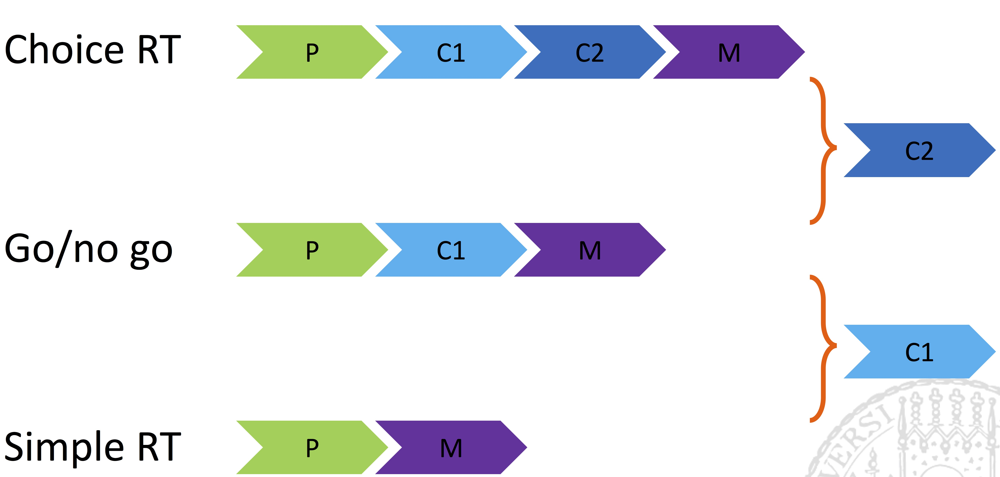
```

# What if we do not observe a difference?
\begincols {0.6\textwidth}

* Then we have a puzzle to solve
    1. C1 does not take place at all
    2. C1 takes place in both cases
    3. Our test did not have enough power

\colsep {0.4\textwidth}
```{r, fig.align='center', out.width='85%'}

```
\endcols

# Example: Posner & Mitchell (1967)

\begincols {0.6\textwidth}

* Using different stimuli, keeping the same task
    * Task: Are two letters both consonants or both vowels?

* For examples:
    * AA, BB - same shape
    * Aa, Bb - same name
    * AE, BC - same category

\colsep {0.4\textwidth}
```{r, fig.align='center', out.width='85%'}

```
> Michael Posner won National Medal of Science (2008)

\endcols

# Example: Posner & Mitchell (1967)

```{r, out.width='100%'}
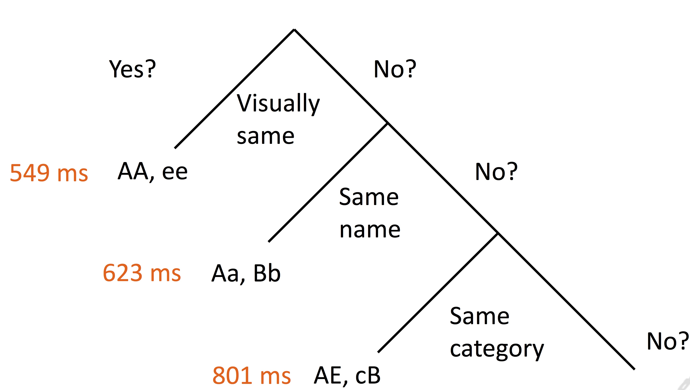
```

* Name comparison: 74 ms (623 - 549)
* Category comparison: 178 ms (801 - 623)

# Application in neurosciences
\begincols {0.6\textwidth}

* Prevailing method in fMRI (PET)
    * Cognitive subtraction to find regions associated with certain cognitive functions
* Typical design, blocks of trials with
    * Resting/baseline
    * A simple condition
    * A more complex condition

\colsep {0.4\textwidth}
```{r, fig.align='center', out.width='85%'}
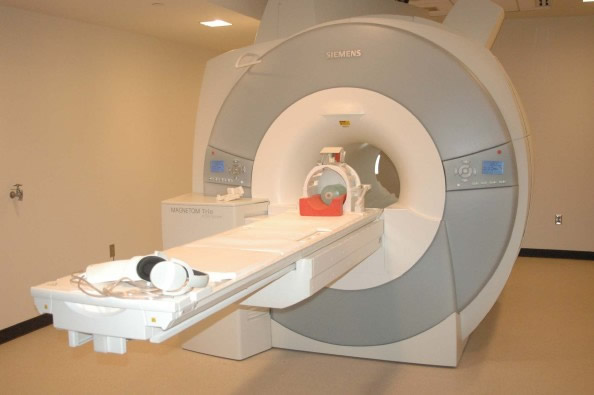
```
\endcols

# Subtraction method in neurosciences
```{r, out.width='100%'}
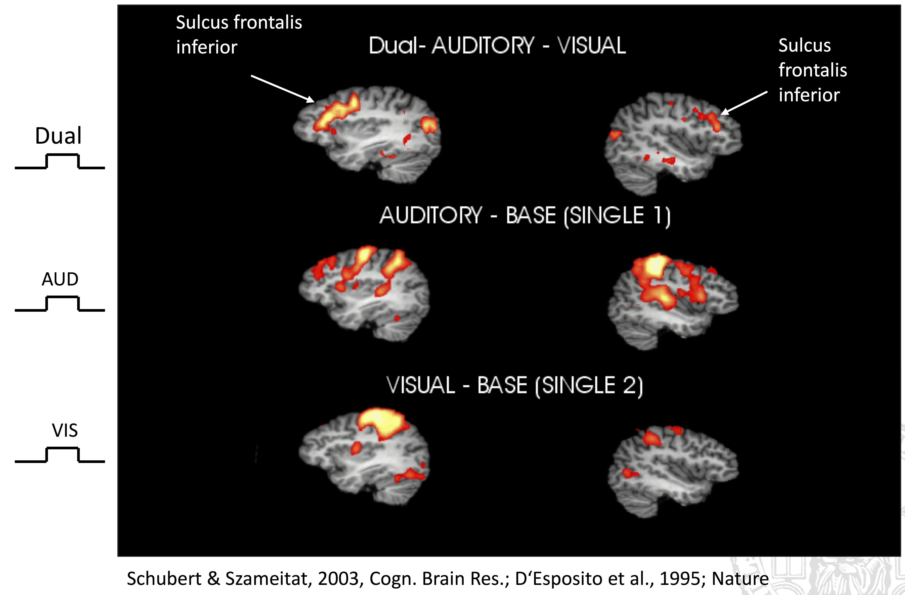
```

# Does this really make sense?

\pause

* Transitivity problem
    * Do individually isolated durations sum up to the duration of the conditions in which they all take place?

```{r, out.width='100%'}
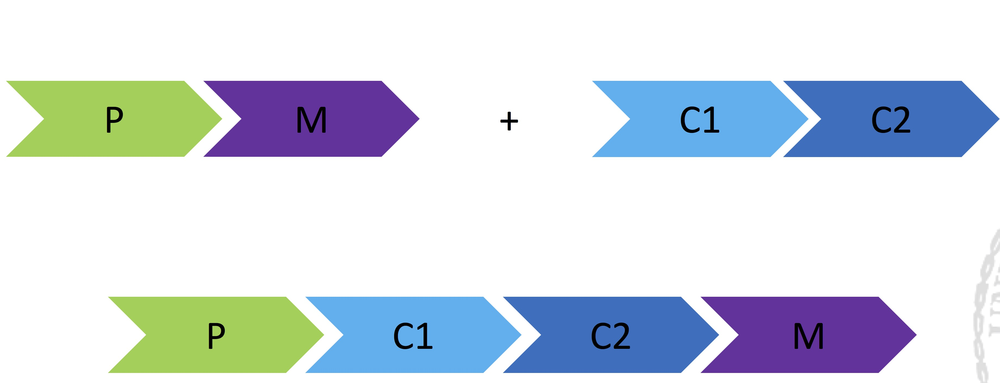
```

# Why subtraction method fails?

\begincols {0.5\textwidth}

__Assumption__

* Pure insertion
    * insertion/removal of processing stages does not influence other processing stages
* Successive processing
    * subcomponents do not overlap and add independently to the overall RT

\colsep {0.5\textwidth}

__Criticsm__

* Külpe (1893): insertion of a new process changes of the whole task
* Cascades/overlapping processing is much more plausible processing architecture

\endcols

# Summary - subtraction method
* Subtraction method is very useful, especially for fMRI
    * fMRI subtracts __space__
    * RT subtracts __time__
    * subtraction method in fMRI does not tell much about _connectivity patterns_.
* Not a very plausible model for complexity cognitive system
    * e.g., massively parallel system

# Additive factor method (AFM)

* No pure insertion assumption
* Change in paradigm (compared to pure insertion)
    * keeping the task __same__
    * Varying task properties
* Change in questions
    * What __independent__ cognitive processes determine task performance?
* Developed by Sternberg (1969)

# Additive factor method (AFM)
* Change in paradigm

```{r, out.width='100%'}
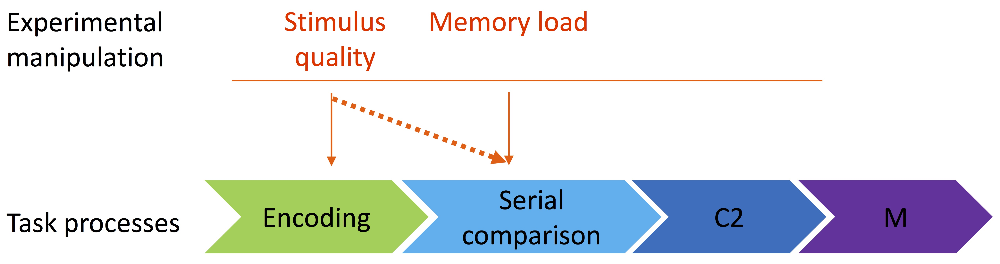
```

* if __two__ experimental manipulations influence __different stages__, they should produce __additive RT effects__
* if there are additive effects, there are different processing stages

# Sternberg task

* Task
    * Memory list followed by a test stimulus
    * Was the test in the memory list?

> L B R F --> B ?

* Manipulated factors:
    * Test quality (degraded vs. intact)
    * Memory load (1, 2, or 4 items)

# Sternberg task

\begincols {0.5\textwidth}

* Main effect of _stimulus quality_
* Main effect of _load_
* No interaction!
* These two properties influence independent processes

\colsep {0.5\textwidth}

```{r, fig.align='middle', out.width='85%'}
dat = data.frame(rt = c(377,400, 440, 412, 440, 480),
                 quality = c(rep('Intact',3), rep('Degraded',3)),
                 load = rep(c('1 Item','2 Items','4 Items'),2))
ggplot(dat, aes(quality, rt, color = load, group = load, shape = load)) + geom_line() + geom_point(size = 5) +  ylab('RT (ms)') +
  theme_bw() + theme(text = element_text(size=25))
```
\endcols


# What if we have no interactions?
\pause

\begincols {0.6\textwidth}

* Manipulations affect independent processes
* Or, the test was not powerful enough

\colsep {0.4\textwidth}
```{r, out.width='90%'}

```
\endcols

# Example: AFM in cognitive neuroscience

* Cognitive and neural mechanisms of number comparison (Dehaene, 1996)
    * A number is presented on the display and subjects decide whether the number is __greater__ or __less__ than 5.

* Manipulations:
    * Input: Arabic digits / spelled numbers (4 / four)
    * Comparison: Near 5 / far from 5
    * Response: dominant / non-dominant hand

# Cognitive model

```{r, out.width='100%'}
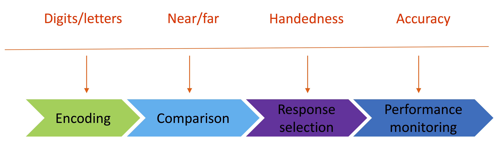
```

# AFM in RTs

\begincols {0.5\textwidth}

* Each manipulation produced a significant main effect
* But no interactions!

\colsep {0.5\textwidth}

```{r, fig.align='middle', out.width='100%'}
dat = data.frame(rt = c(383,395, 420, 435, 363, 375, 407, 417),
                 Comparison = c(rep('Close',4), rep('Far',4)),
                 Input = rep(c('Arabic','Arabic','Spelled','Spelled'),2),
                 Response = rep(c('Right','Left'),4))
ggplot(dat, aes(Comparison, rt, color = Response, group = interaction(Response,Input), shape = Input)) + geom_line() + geom_point(size = 5) +  ylab('RT (ms)') +
  theme_bw() + theme(text = element_text(size=25))
```
\endcols

# Brain regions involved in the task

\begincols {0.5\textwidth}

* Distinct brain regions were modulated by different manipulations

\colsep {0.5\textwidth}

```{r, out.width='100%'}
knitr::include_graphics('figs/brain_number_task.png')
```

\endcols

# Does AFM make sense?

\pause

* __Partially__

* No problem with 'pure insertion'
    * Manipulation of the duration of a processing stages
* Criticism of Külpe does not hold
    * Comparison between one and the same type of tasks


# Does AFM make sense?

* __Not completely__

* Still assumption of serial processing stages
* Reversed inference fallacy
    * __If p then q__: Manipulation of independent stages will produce additive results
    * But, this does not imply __if q then p__: Failing to observe significant interactions does not imply independence of stages

# Summary of AFM
* Same task, but different manipulations
* each manipulation affect processes independently
* No problem of 'pure insertion'
* Be aware of the reversed inference fallacy

# Next week "Hands-on"

* CIP room (Leopoldstr. 44)
* Import RT data from text files
* Summarize RT data
* required packages in R: __data.table__, __dplyr__ and __ggplot2__
