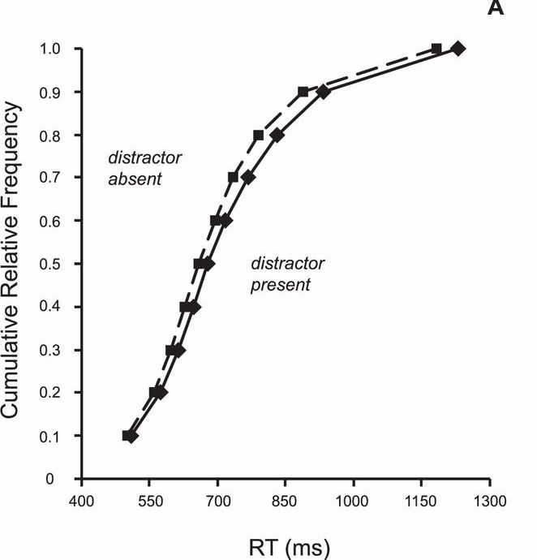
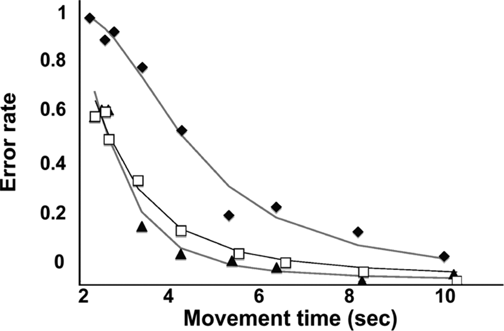

```{r setup, include=FALSE}
library(knitr)
library(pander)
library(ggplot2)
library(dplyr)
library(xtable)
options(xtable.comment=FALSE, digits = 2)
knitr::opts_chunk$set(echo = FALSE,fig.align='center')
```

# Summary Lecture I

* Please describe __Donders' subtraction method__. 
    * Please give one example of 'Subtraction' method
    
\pause

* Please describe __Additive factor method__
    * please give one example. 

\pause

* Potential problems with _Donder's subtraction method_

\pause 

* Potential problems with _Additive factor method_

# discrete sequential stages vs. Cascaded/Parallel processes

* Both Subtraction method and AFM require _Sequential processing_

```{r, out.width='60%', fig.width=6}
knitr::include_graphics('figs/mcclelland_cascade.pdf')
```

# Continuous models of information processing

\begincols {0.6\textwidth}

* Cascade model of information processing
    * Each stage is continously active and feeds to the next stage. 
    * An experimental manipulation may affect a stage by altering the __rate__ of activation or the __asymptotic level__ of activation. 
    * The asymptotic level is equivalent to the stage output in the discrete stage model. 

\colsep {0.4\textwidth}   
    
```{r activation_fun, echo = FALSE, out.width = '98%',fig.width= 4, fig.height=3}
ggplot(data.frame(t = c(0,2)), aes(t)) + 
    stat_function(fun = function(t) 1-exp(-t), 
                 aes(colour = 'Rate 1, Max 1')) +
    stat_function(fun = function(t) (1-exp(-2*t)), 
                 aes(colour = 'Rate 2, Max 1')) + 
    ylab('Activation') + xlab('Time (sec)') + theme_bw() +
    theme(legend.position = c(0.2,0.8), legend.title = element_blank()) 
  
```

\endcols

# Cascade model vs. AFM

* Simulations show that assumption of cascaded processes allows emergence of additive effects of manipulations of the same processing stage. 
* Additive effects may also result from two factors affecting the rates of two different processes
* Different interprepretation of interaction than AFM:
    * Interactions are possible if two manipulations affect different types of processes (e.g., A affects the rate of stage 1, and B impacts asymptotic component of stage 2).

# Example of interaction in cascade model

\begincols {0.5\textwidth}

* Meyer et al. (1975) Lexical decision task (word vs. nonword)
    * Preceded by a prime word
    * Manipulation: 
        * degradation of the prime word
        * semantial relatedness
  
\colsep {0.5\textwidth}   

```{r Meyer1975, echo = FALSE, out.width = '98%',fig.width= 4, fig.height=4 }
meyer = data.frame(RT = c(566,528,728,657), 
         Degradation = c('Intact','Intact', 'Degraded','Degraded'), 
         Semantics = c('Unassociated','Associated','Unassociated','Associated'))
ggplot(data = meyer, aes(x = Degradation, y = RT, fill = Semantics)) + 
  geom_bar(stat='identity', position = 'dodge') + coord_cartesian(ylim = c(450,800)) + theme_bw() +
    theme(legend.position = c(0.8,0.8), legend.title = element_blank()) 
  
```

\endcols

# Example of interaction in cascade model

* (A) Interaction of visual degradation and (B) semantic relatedness
* AFM interpretation:
    * A and B affect one same stage: Early encoding of visual information (Meyer et al., 1975)
* Cascade model:
    * Interaction could be related to manipulation of two processes:
        * A on rate of encoding
        * B on asymptotic maximum of semantic retrieval process
* Cascade model takes more naturalistic view on mental proceses
    * assumption of parallel processing highly plausible 
    * but no easy assessment of the duration of mental processes
 
# Continuous models of information processing

\begincols {0.5\textwidth}

* Accumulation models
    * decisions are built up with accumulation of information. 
    * e.g., stochastic diffusion model (Ratcliff, 1979)

\begin{align*}
RT &= T_{0} +  X_{decision} \\
dX(t) &= vdt + sdW(t)
\end{align*}

\colsep {0.5\textwidth}  

```{r, out.width='95%'}
include_graphics('figs/diffusion.pdf')
```

>      - Grasman et al. (2009)

\endcols

# Evidence accrual vs. discrete processes

* Classical discrete processes 
    * A chain of discrete processes
* Accrual model considers RTs as continuous durations of all previous decisions
* Two methods can be combined together to evaluate underlying processes
    * Compare diffusion parameters across tasks (subtraction method + diffusion)
    * Explicit modeling of a decision chain (AFM + diffusion)
    
# Accumulation/diffusion models

* Provide several dependent measures for which effects of experimental manipulations can be assessed
* Combine well with classical experimental methods
* Can predict both mean RTs and RT distributions, and error patterns

# RT distributions

* The whole RT distribution provide more rich information than __mean__ and __standard error__ of RTs. 

```{r rtDistr, echo = FALSE, out.width= '70%', fig.width=4, fig.height=3}
dat = read.csv('stroop.csv')
dat %>% filter(rt < 2) %>% 
  ggplot(aes(x = rt, fill = congruency)) + geom_histogram(bins = 30)
```

# Parameters of RT distributions

\begincols {0.5\textwidth}

* Three important parameters
    * First order (Mean, median, mode)
    * Variability (Variance, semi-inter-quartile range)
    * Asymmetry (skewness)

\colsep {0.5\textwidth}  

```{r rtDistr2, echo = FALSE, out.width= '95%', fig.width=3, fig.height=3}
dat %>% filter(rt < 2) %>% 
  ggplot(aes(x = rt, fill = congruency)) + geom_histogram(bins = 30)
```

\endcols

# Why RT distribution is left skewed?

\pause

* RT distribution is non-negative distribution
* biological constrains on fastest response time
* tendency of delay response
* RT distribution can be regarded as the first passage time of a diffusion process


# Drift diffusion model (DDM, Ratcliff, 1978)

\begincols {0.6\textwidth}

* Accumulations of difference between the amounts of evidence supporting the two alternative hypothese. 
    * Upper bound and lower bound (i.e., decision thresholds for 2AFC)
    * A starting point, which reflects initial evidence (prior)
    * Information accumulation drifts towards two boundries with different drift rate (v)
    * When information reach the thresholds, response is fired. 
    
\colsep {0.4\textwidth}  

```{r, out.width='95%'}
include_graphics('figs/ddf.pdf')
```
 
- Bogacz et al., 2006, Psychological review

\endcols

# Parameters in DDM

\begincols {0.5\textwidth}

Original DDM (ratcliff, 1978) has 4 parameters:

* drift rate $v$
* threshold separation ($a$)
* starting-point ($z$)
* Non-deicsion time ($t_0$)

\colsep {0.5\textwidth}  

```{r, out.width='95%'}
include_graphics('figs/diffusion.pdf')
```

>      - Grasman et al. (2009)

\endcols

# Interpretation of DDM parameters

The most important part in a diffusion model analysis is determing which psychological processes are mapped by the parameters. 

\pause

* drift rate ($v$): speed of information update
    * easy task - large drift rate; difficult task - small drift rate

\pause

* Threshold separate ($a$) 
    * Amount of information for a decision: conservative - large $a$, liberal - small $a$

\pause

* Starting point ($z$): A priori biases in the decision thresholds

\pause

* Nondecision processes ($t_0$)
    * encoding process, response excusion (e.g., aging difference).

# Potential candidates for RT distributions

DDM does not have a closed-form solution for RT distributions, but RT distributions can be approximated by:

* Ex-Gaussian: Convolution of a Gaussian and an exponential distribution
* Wald (Inverse-Gaussian): Related to the first passage time of a diffusion process
* Ex-Wald: Convolution of a exponential and a Wald distribution
* Gamma: The sum of a series of exponential processes
* Weibull distribution

Those candidates provide good fit to the emprical data (Palmer & Horwitz, 2012) 

# Inverse-Gaussian (Wald) distribution 

* Probability density function

$$ f(x; u, \lambda) = [\frac{\lambda}{2\pi x^3}]^{1/2} \exp (\frac{-\lambda (x-\mu)^2}{2\mu^2 x}) $$

* It is the distribution of first passage time of a Brownian motion
* If error rate is small enough, it is a good approxmiation for RT distribution


# Cumulative density function (CDF) and Vincentization

\begincols {0.5\textwidth}

* Empirical RTs are pooled together, ordered, Vincentized
    * Sort RT in an ascending order
    * Calculate percentile (e.g., 10% RT percentile: 10% of fastest trials)

\colsep {0.5\textwidth}  

```{r, out.width='95%'}

```

>      - Leber et al. (2013), JOV
  
\endcols

# Mini task: find the valude of 50% percentile.

* RTs:

> 334, 556, 200, 244, 890, 348, 660, 740, 500, 349

\pause

> 200, 244, 334, 348, __349__, ...

* 50% percentile in 10 trials is #5 - 349 ms

# Application of Vincentization
* Using Vincentization, we can comapre different RT quantiles across different manipulations
* Vincentization can distinguish specific and general effect
    * Specific effect: manipulation only affect a portion of RT trials
    * General effect: observing effects across all RT percentiles

# Speed-accuracy trade-off function

* RTs typically co-vary with error rates

```{r, out.width='75%'}

```
> Reis et al., PNAS, 2009

# Why is this important?

\begincols {0.5\textwidth}

Effect in RTs may reflect 

* effects of your manipulations
* shifts in position on SAT function


\colsep {0.5\textwidth}  

```{r, out.width='95%', fig.width= 4, fig.height=4}

ggplot(data.frame(t = c(0.1,2)), aes(t)) + 
    stat_function(fun = function(t) 0.4*exp(-t), 
                 aes(colour = 'Difficult')) +
    stat_function(fun = function(t) 0.4*(exp(-2*t)), 
                 aes(colour = 'Easy')) + 
    ylab('Error rate') + xlab('Time (sec)') + theme_bw() +
    theme(legend.position = c(0.8,0.8), legend.title = element_blank()) 

```


\endcols

# Controlling for SAT shifts

* Maintain either exposure time or error rate constant
    * Exposure time constants - using the masking paradigm
    * error rate constant - providing feedback and reward/punishment
* If RT is your main dependent variable, you should make sure the error rates are relative equal across different experimental manipulations. 


